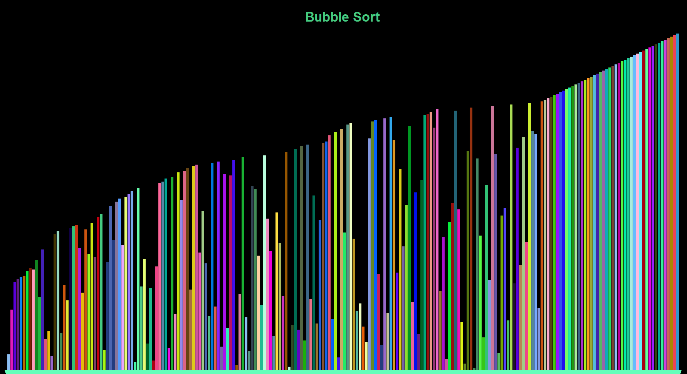

# TurtleSort




Visual demonstrations of sorting algorithms using
Python turtle graphics framework.
Author: alexpdev

## Requires

Python >= v3.0

### Installing

To install, follow these steps:

Option 1:

1. Ensure Git is installed and working
2. Open terminal and run ...

Option 2:

1. unzip contents into it's own directory.
2. ensure Python v3.* is installed and working
3. enter the following in the terminal commandline

```Windows:
git clone https://github.com/alexpdev/turtlesort.git blackJack
```

### Usage

```Windows
python path\to\project\main.py
```

### License

GNU GPL v3

### Other

| Procedure | Status|
|-----------|:------:|
| Bubble Sort | Active |
| Selection Sort | Active |
| Insertion Sort | Active |
| Merge Sort | Active |
| Quick Sort | Active |
| Cycle Sort | Active |
